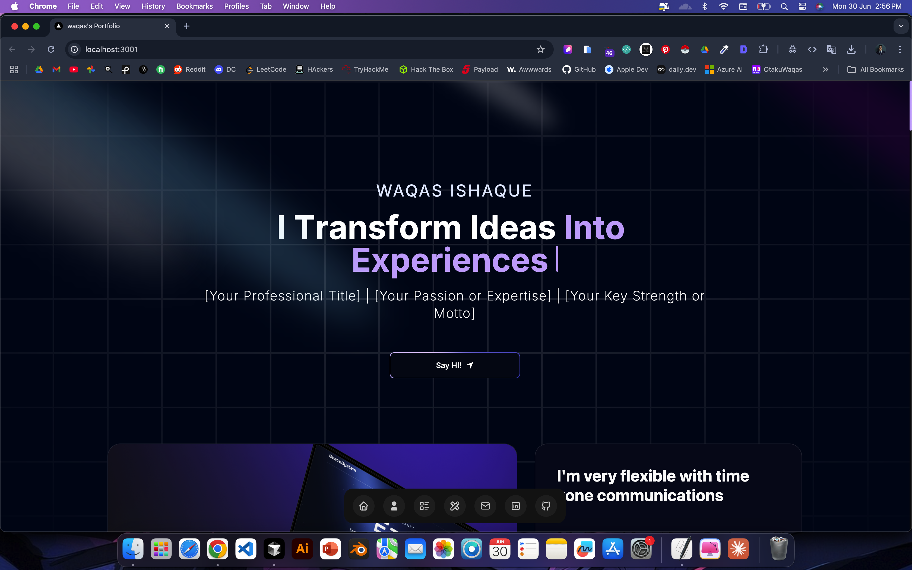
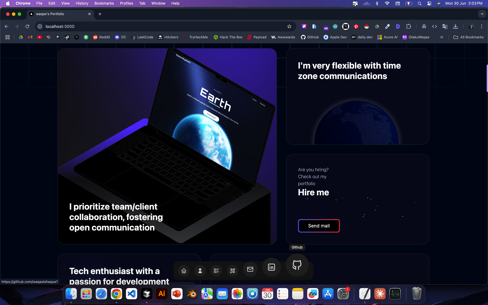
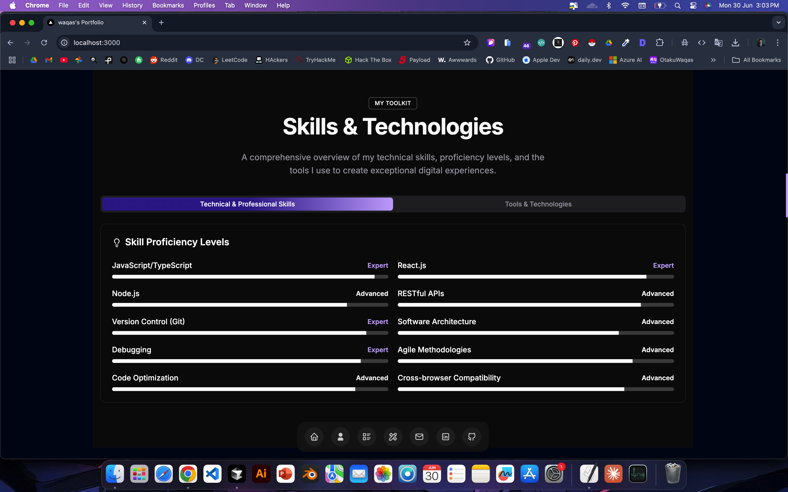
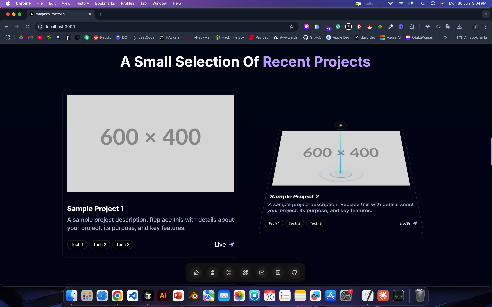
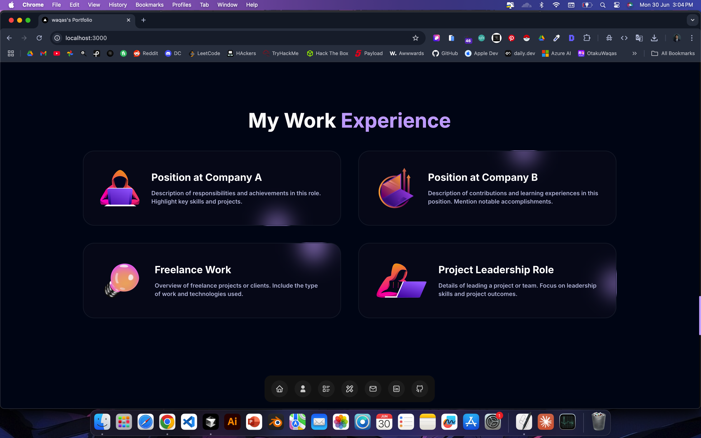
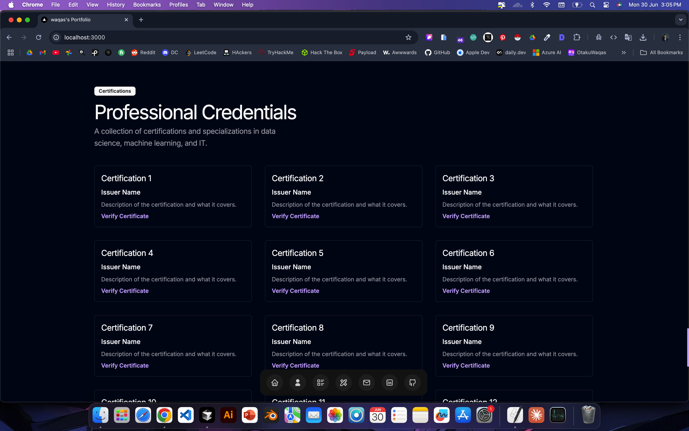
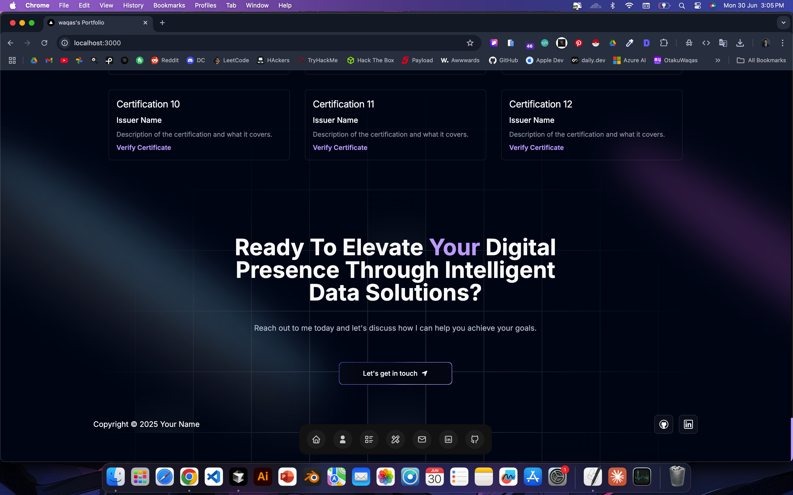

# 🚀 One Click Deploy
[](https://deploy.workers.cloudflare.com/?url=https://github.com/WaqasIshaque1/portfolio-template)
[](https://vercel.com/new/clone?repository-url=https%3A%2F%2Fgithub.com%2FWaqasIshaque1%2Fportfolio-template&project-name=devfolio-waqas&repository-name=devfolio-waqas-ishaque&redirect-url=https%3A%2F%2Fgithub.com%2FWaqasIshaque1%2Fportfolio-template&demo-title=Devfolio%20by%20WAQAS%20ISHAQUE&demo-description=Minimal%20portfolio%20template%20made%20using%20next%2014%20and%20Acceternity%20UI%20using%20tailwind%20css%20for%20styling&demo-url=https%3A%2F%2Fportfolio-template-six-rust.vercel.app&demo-image=https%3A%2F%2Fportfolio-template-six-rust.vercel.app%2Fscr1.png)

---

# 🗂️ Table of Contents
- [💡 Overview](#-overview)
- [🛠️ Technologies Used](#️-technologies-used)
- [✨ Key Features](#-key-features)
- [🖼️ Screenshots](#-screenshots)
- [⚡ Getting Started](#-getting-started)
- [🤝 Contributing](#-contributing)

---

# 💡 Overview
> **Showcase your skills with a modern, interactive portfolio.**

This portfolio leverages **Next.js** for UI, **Three.js** for 3D, **Framer Motion** for animations, and **TailwindCSS** for styling. It's designed for a memorable, innovative presentation of your work.

---

# 🛠️ Technologies Used

<div align="center">
  
  
  
  
  
</div>

---

# ✨ Key Features

- 🎬 **Hero Section:** Dynamic lighting and animated backdrop for a strong first impression.
- 🟫 **Bento Grid:** Modern layout with advanced CSS for personal details.
- 🌐 **3D Components:** Interactive globe and card animations.
- 💬 **Testimonials:** Animated, smooth-scrolling client feedback.
- 🕰️ **Professional History:** Career timeline for enhanced visibility.
- 🖼️ **Canvas Integration:** Creative HTML5 canvas visuals.
- 📱 **Device Compatibility:** Fully responsive, modular, and robust code structure.

---

# 🖼️ Screenshots
<p align="center">
  <table>
    <tr>
      <td></td>
      <td></td>
    </tr>
    <tr>
      <td></td>
      <td></td>
    </tr>
    <tr>
      <td></td>
      <td></td>
    </tr>
    <tr>
      <td></td>
      <td></td>
    </tr>
  </table>
</p>

---

# ⚡ Getting Started

> **Quickstart:**

### 1. Install Dependencies
Choose your favorite package manager and run:

```sh
npm install   # or yarn install   # or pnpm install   # or bun install
```

### 2. Run the Development Server

```sh
npm run dev   # or yarn dev   # or pnpm dev   # or bun run dev
```

Open [http://localhost:3000](http://localhost:3000) to see your portfolio.

---

# 🤝 Contributing

Contributions are **welcome**! If you have suggestions, improvements, or find a bug, please open an issue or submit a pull request.
